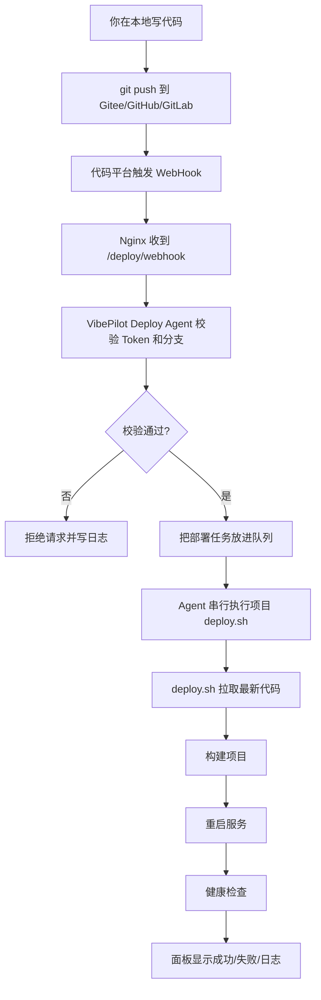
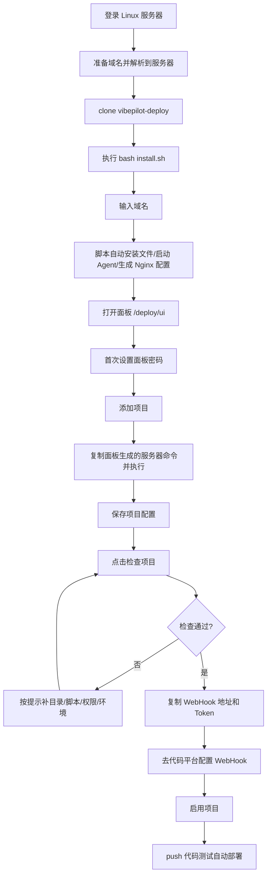
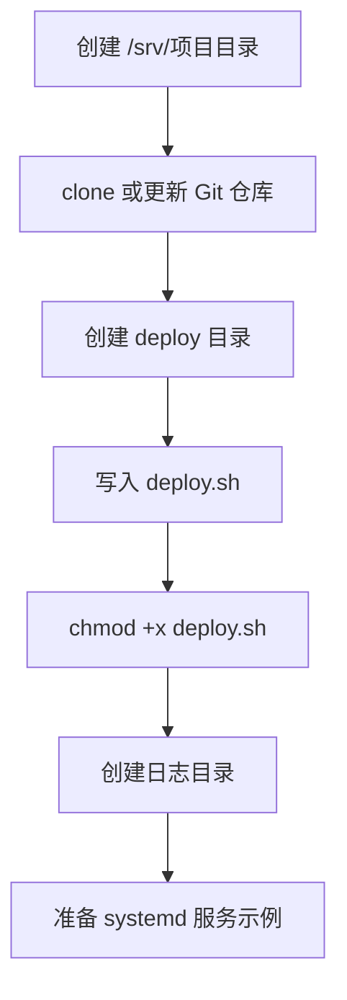
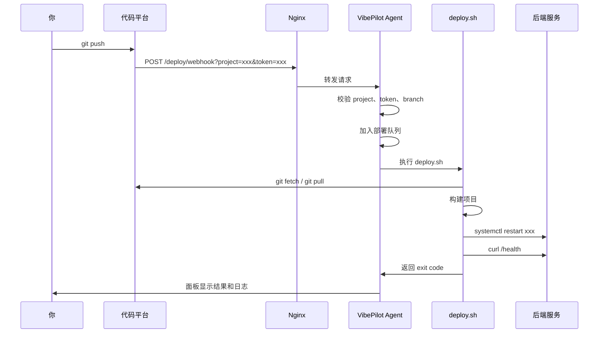
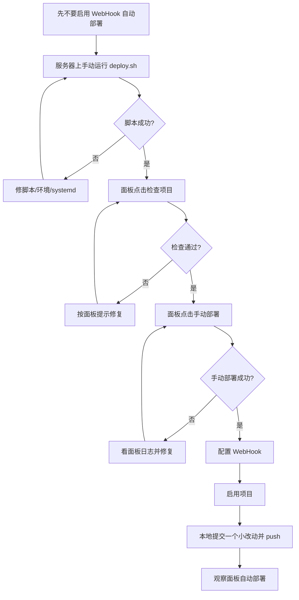
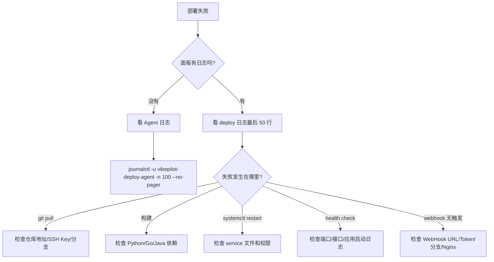

# VibePilot Deploy 小白全流程图

这份文档按“我什么都不懂，也要把后端项目自动部署起来”的角度写。

你最终要得到的是：

- 一台 Linux 服务器。
- 一个可以打开的部署面板：`https://你的域名/deploy/ui`。
- 一个后端项目目录，例如 `/srv/python-api`、`/srv/go-api`、`/srv/java-api`。
- 一个部署脚本，例如 `/srv/python-api/deploy/deploy.sh`。
- 一个 WebHook：你每次 `git push` 后，代码平台通知 VibePilot，VibePilot 自动执行部署脚本。

## 0. 先看懂整套东西在做什么



一句话理解：

`VibePilot Deploy` 本身不关心你的项目是 Python、Go 还是 Java。它只负责接收 WebHook，然后执行你指定的 `deploy.sh`。真正怎么构建、怎么重启服务，都写在每个项目自己的 `deploy.sh` 里。

## 1. 你要准备什么

### 本地电脑

- 能正常写代码。
- 能 `git push` 到你的代码仓库。

### 代码平台

任选一个：

- Gitee
- GitHub
- GitLab

后面都叫“代码平台”。

### Linux 服务器

建议最低：

- 1 核 CPU。
- 1GB 内存。
- Ubuntu / Debian / CentOS / Rocky Linux 都可以。
- 有 root 权限，或者能用 `sudo`。
- 已安装 `git`。这是安装面板前的前置条件，需要你自己先装好，因为第一步 `git clone` 就要用到它。
- 如果要用域名访问，先把域名解析到这台服务器；Nginx 可以让安装脚本自动安装。

如果服务器没有 `git`，先执行：

```bash
# Ubuntu / Debian
apt update
apt install -y git

# CentOS / Rocky
dnf install -y git
```

### 项目运行环境

按项目类型准备：

- Python 项目：`python3`、`python3-venv`、`pip`。
- Go 项目：`go`。
- Java 项目：`jdk`、`maven`。

## 2. 总安装流程图



## 3. 安装 VibePilot Deploy

下面命令在服务器上执行。

```bash
cd /root
git clone https://gitee.com/XC1960/mini_deploy.git vibepilot-deploy
cd /root/vibepilot-deploy
bash install.sh
```

脚本会先问你安装向导语言：

```text
请选择安装向导语言 / Select installer language (zh/en，默认 zh):
```

直接回车就是中文。  
如果你想用英文向导，输入：

```text
en
```

然后脚本会继续问部署面板域名：

```text
请输入部署面板域名，例如 deploy.example.com；直接回车则跳过 Nginx 自动配置:
```

你填自己的域名，例如：

```text
deploy.example.com
```

然后脚本会自动做这些事：

- 复制程序到 `/opt/vibepilot-deploy`。
- 创建 `/etc/vibepilot-deploy-agent.env`。
- 创建 `/opt/vibepilot-deploy/projects.json`。
- 安装 systemd 服务。
- 启动 `vibepilot-deploy-agent`。
- 如果服务器没装 Nginx，会问你是否自动安装。
- 自动写入 `/etc/nginx/conf.d/vibepilot-deploy.conf`。
- 自动执行 `nginx -t`。
- 自动重载 Nginx。
- 输出最终访问地址。

正常情况下，你只需要打开脚本最后输出的地址：

```text
http://deploy.example.com/deploy/ui
```

如果你已经配好 HTTPS 或后续用 certbot 申请证书，就打开：

```text
https://deploy.example.com/deploy/ui
```

如果你想完全不交互，也可以一条命令预填域名：

```bash
DEPLOY_DOMAIN=deploy.example.com bash install.sh
```

如果你想完全使用英文向导：

```bash
INSTALL_LANG=en DEPLOY_DOMAIN=deploy.example.com bash install.sh
```

如果你暂时没有域名，直接回车跳过，先用服务器本机测试：

```text
http://127.0.0.1:9010/ui
```

## 4. 安装后只需要检查这三件事

### 4.1 Agent 是否启动

```bash
systemctl status vibepilot-deploy-agent
curl http://127.0.0.1:9010/health
```

看到类似下面这样就正常：

```json
{"status":"ok","queue_size":0}
```

如果失败，先看日志：

```bash
journalctl -u vibepilot-deploy-agent -n 100 --no-pager
tail -n 100 /var/log/vibepilot/vibepilot-deploy-agent.log
```

### 4.2 Nginx 是否自动生成

如果你安装时填了域名，脚本会生成：

```text
/etc/nginx/conf.d/vibepilot-deploy.conf
```

你只需要检查：

```bash
nginx -t
systemctl status nginx
```

### 4.3 面板是否能打开

浏览器访问：

```text
http://deploy.example.com/deploy/ui
```

第一次打开会让你设置管理员密码。设置后密码会加密写入：

```text
/etc/vibepilot-deploy-agent.env
```

设置完以后建议重启一次 Agent：

```bash
systemctl restart vibepilot-deploy-agent
```

如果你想启用 HTTPS，推荐使用 certbot：

```bash
apt install -y certbot python3-certbot-nginx
certbot --nginx -d deploy.example.com
```

安装脚本会检测 `certbot`。如果没有，会询问是否自动安装；如果你跳过 HTTPS，HTTP 地址 `http://deploy.example.com/deploy/ui` 仍然可以访问，只是不建议长期公网裸奔使用。

## 5. 面板里添加项目时怎么填

进入面板后，点击“添加仓库”。

常见字段这样理解：

| 字段 | 含义 | 示例 |
| --- | --- | --- |
| 项目标识 | 项目的唯一 key，只用英文数字横线下划线 | `python-api` |
| 显示名称 | 面板上看到的名字 | `Python API` |
| 项目类型 | 用来生成基础部署脚本 | `Python / systemd` |
| 仓库地址 | 你的 Git 仓库地址 | `git@gitee.com:your-org/python-api.git` |
| 部署分支 | push 哪个分支才触发部署 | `main` 或 `master` |
| 服务器目录 | 代码放到服务器哪里 | `/srv/python-api` |
| 部署脚本 | Agent 要执行哪个脚本 | `/srv/python-api/deploy/deploy.sh` |
| 健康检查 | 部署后检查接口是否可访问 | `http://127.0.0.1:8001/health` |
| 日志文件 | 部署脚本输出日志位置 | `/var/log/vibepilot/python-api-deploy.log` |
| WebHook Token | 代码平台调用 WebHook 时的密码 | 面板自动生成 |
| 启用项目 | 是否接收 WebHook | 脚本确认无误后再勾 |
| 允许手动部署 | 是否允许在面板点按钮部署 | 建议勾选 |

### 5.1 服务器访问仓库权限怎么处理

部署脚本要在服务器上执行 `git clone` / `git pull`。所以服务器必须有权限访问你的代码仓库。

最常见做法是 SSH Deploy Key：

```bash
# 1. 在服务器生成 SSH Key。如果已经有，可以跳过。
ssh-keygen -t ed25519 -C deploy@$(hostname)

# 2. 查看公钥。
cat ~/.ssh/id_ed25519.pub

# 3. 把输出的整行公钥复制到 Gitee/GitHub/GitLab 的 Deploy Key 或 SSH Key。
```

然后在服务器测试：

```bash
ssh -T git@gitee.com
git ls-remote git@gitee.com:你的组织/你的仓库.git HEAD
```

能看到提交哈希，说明服务器有权限拉代码。

面板生成的“服务器执行指令”里也会自动加入 `git ls-remote` 检查。如果权限不通，会直接提示你去配置 SSH Key，不会继续往下部署。

## 6. 面板生成的“服务器执行指令”是什么

添加项目时，面板会生成一段命令。你需要复制到服务器执行。

它通常会做这些事：



执行完后，回到面板点击：

1. 保存项目。
2. 检查项目。
3. 没有红色错误后，再勾选“启用项目”。

### 6.1 业务服务配置到底是什么

这一块是小白最容易懵的地方。简单说：

VibePilot 负责执行 `deploy.sh`，但你的后端服务怎么启动，取决于项目本身。你需要确认 4 件事：

1. 构建命令是什么。
2. 服务怎么启动和重启。
3. 服务监听哪个端口。
4. 健康检查接口是什么。

#### 构建命令

构建命令就是把代码变成可运行程序的命令。

Python 常见是安装依赖：

```bash
python3 -m venv .venv
. .venv/bin/activate
pip install -r requirements.txt
```

Go 常见是编译二进制：

```bash
go mod download
go build -o bin/go-api ./cmd/server
```

Java 常见是打 Jar 包：

```bash
mvn clean package -DskipTests
```

#### 服务启动和重启

服务器上长期运行后端服务，一般交给 systemd 管。

你会有一个文件：

```text
/etc/systemd/system/你的服务名.service
```

比如：

```text
/etc/systemd/system/python-api.service
```

部署脚本里只需要重启它：

```bash
systemctl restart python-api
```

#### 服务端口

端口就是你的服务监听在哪里。

例如：

- Python FastAPI：`127.0.0.1:8001`
- Go API：`127.0.0.1:8002`
- Java Spring Boot：`127.0.0.1:8003`

如果你要让外部用户访问业务 API，通常再用 Nginx 把公网域名转发到这些本地端口。

#### 健康检查

健康检查就是部署后用一个 URL 判断服务是否真的启动成功。

例如：

```text
http://127.0.0.1:8001/health
http://127.0.0.1:8002/health
http://127.0.0.1:8003/actuator/health
```

部署脚本最后会执行：

```bash
curl -fsS --max-time 10 http://127.0.0.1:8001/health
```

如果 curl 成功，部署算成功；如果 curl 失败，面板会显示失败。

#### 哪些能自动生成，哪些要你确认

面板可以帮你生成基础脚本和 systemd 示例，但它不知道你的真实项目细节。

你需要确认：

- Python 入口是不是 `app.main:app`。
- Go 入口是不是 `./cmd/server`。
- Java 是 Maven 还是 Gradle。
- 服务端口是不是示例里的 `8001/8002/8003`。
- 健康检查接口是否真实存在。
- 服务名是否和 systemd 文件一致。

## 7. WebHook 触发流程图



## 8. 示例一：Python 后端

这里用 FastAPI 举例，端口 `8001`，项目目录 `/srv/python-api`，systemd 服务名 `python-api`。

### 8.1 Python 项目仓库结构

你的仓库可以长这样：

```text
python-api/
├── app/
│   └── main.py
├── requirements.txt
└── deploy/
    └── deploy.sh
```

`app/main.py` 示例：

```python
from fastapi import FastAPI

app = FastAPI()

@app.get("/health")
def health():
    return {"status": "ok"}
```

`requirements.txt` 示例：

```text
fastapi
uvicorn[standard]
gunicorn
```

### 8.2 安装 Python 运行环境

Ubuntu / Debian：

```bash
apt update
apt install -y git python3 python3-venv python3-pip nginx
```

CentOS / Rocky：

```bash
dnf install -y git python3 python3-pip nginx
```

### 8.3 创建 systemd 服务

创建文件：

```bash
nano /etc/systemd/system/python-api.service
```

写入：

```ini
[Unit]
Description=Python FastAPI service
After=network.target

[Service]
Type=simple
WorkingDirectory=/srv/python-api
ExecStart=/srv/python-api/.venv/bin/gunicorn app.main:app -k uvicorn.workers.UvicornWorker -w 2 -b 127.0.0.1:8001
Restart=always
RestartSec=3
Environment=PYTHONUNBUFFERED=1

[Install]
WantedBy=multi-user.target
```

启用服务：

```bash
systemctl daemon-reload
systemctl enable python-api
```

### 8.4 Python deploy.sh

文件路径：

```text
/srv/python-api/deploy/deploy.sh
```

内容：

```bash
#!/usr/bin/env bash
set -Eeuo pipefail

PROJECT_DIR="${PROJECT_DIR:-/srv/python-api}"
BRANCH="${DEPLOY_BRANCH:-main}"
LOG_FILE="${DEPLOY_LOG_FILE:-/var/log/vibepilot/python-api-deploy.log}"
HEALTH_URL="${HEALTH_URL:-http://127.0.0.1:8001/health}"

mkdir -p "$(dirname "$LOG_FILE")"

log() {
  printf '%s %s\n' "$(date '+%Y-%m-%d %H:%M:%S')" "$*" | tee -a "$LOG_FILE"
}

cd "$PROJECT_DIR"

log "phase=fetch 拉取最新代码"
git fetch origin "$BRANCH"

log "phase=pull 切换并更新分支"
git checkout "$BRANCH"
git pull --ff-only origin "$BRANCH"

log "phase=website_dependencies 准备 Python 虚拟环境"
python3 -m venv .venv
. .venv/bin/activate
pip install --upgrade pip
pip install -r requirements.txt

log "phase=agent_restart 重启 Python 服务"
systemctl restart python-api

log "phase=health_check 健康检查 $HEALTH_URL"
curl -fsS --max-time 10 "$HEALTH_URL"

log "phase=finished Python 部署完成"
```

设置可执行：

```bash
chmod +x /srv/python-api/deploy/deploy.sh
```

### 8.5 面板里 Python 项目怎么填

| 字段 | 值 |
| --- | --- |
| 项目标识 | `python-api` |
| 显示名称 | `Python API` |
| 项目类型 | `Python / systemd` 或 `Custom script` |
| 仓库地址 | `git@gitee.com:your-org/python-api.git` |
| 部署分支 | `main` |
| 服务器目录 | `/srv/python-api` |
| 部署脚本 | `/srv/python-api/deploy/deploy.sh` |
| 健康检查 | `http://127.0.0.1:8001/health` |
| 日志文件 | `/var/log/vibepilot/python-api-deploy.log` |

### 8.6 Python 手动测试

```bash
cd /srv/python-api
/srv/python-api/deploy/deploy.sh
systemctl status python-api
curl http://127.0.0.1:8001/health
```

## 9. 示例二：Go 后端

这里用 Go HTTP 服务举例，端口 `8002`，项目目录 `/srv/go-api`，systemd 服务名 `go-api`。

### 9.1 Go 项目仓库结构

```text
go-api/
├── cmd/
│   └── server/
│       └── main.go
├── go.mod
└── deploy/
    └── deploy.sh
```

`cmd/server/main.go` 示例：

```go
package main

import (
	"fmt"
	"net/http"
)

func main() {
	http.HandleFunc("/health", func(w http.ResponseWriter, r *http.Request) {
		w.Header().Set("Content-Type", "application/json")
		fmt.Fprint(w, `{"status":"ok"}`)
	})
	http.ListenAndServe("127.0.0.1:8002", nil)
}
```

### 9.2 安装 Go 运行环境

Ubuntu / Debian：

```bash
apt update
apt install -y git golang nginx
```

如果系统自带 Go 太旧，建议到 Go 官方包安装新版本，然后确认：

```bash
go version
```

### 9.3 创建 systemd 服务

```bash
nano /etc/systemd/system/go-api.service
```

写入：

```ini
[Unit]
Description=Go API service
After=network.target

[Service]
Type=simple
WorkingDirectory=/srv/go-api
ExecStart=/srv/go-api/bin/go-api
Restart=always
RestartSec=3

[Install]
WantedBy=multi-user.target
```

启用服务：

```bash
systemctl daemon-reload
systemctl enable go-api
```

### 9.4 Go deploy.sh

文件路径：

```text
/srv/go-api/deploy/deploy.sh
```

内容：

```bash
#!/usr/bin/env bash
set -Eeuo pipefail

PROJECT_DIR="${PROJECT_DIR:-/srv/go-api}"
BRANCH="${DEPLOY_BRANCH:-main}"
LOG_FILE="${DEPLOY_LOG_FILE:-/var/log/vibepilot/go-api-deploy.log}"
HEALTH_URL="${HEALTH_URL:-http://127.0.0.1:8002/health}"

mkdir -p "$(dirname "$LOG_FILE")"

log() {
  printf '%s %s\n' "$(date '+%Y-%m-%d %H:%M:%S')" "$*" | tee -a "$LOG_FILE"
}

cd "$PROJECT_DIR"

log "phase=fetch 拉取最新代码"
git fetch origin "$BRANCH"

log "phase=pull 切换并更新分支"
git checkout "$BRANCH"
git pull --ff-only origin "$BRANCH"

log "phase=docker_build 编译 Go 二进制"
mkdir -p bin
go mod download
go build -o bin/go-api ./cmd/server

log "phase=agent_restart 重启 Go 服务"
systemctl restart go-api

log "phase=health_check 健康检查 $HEALTH_URL"
curl -fsS --max-time 10 "$HEALTH_URL"

log "phase=finished Go 部署完成"
```

设置可执行：

```bash
chmod +x /srv/go-api/deploy/deploy.sh
```

### 9.5 面板里 Go 项目怎么填

| 字段 | 值 |
| --- | --- |
| 项目标识 | `go-api` |
| 显示名称 | `Go API` |
| 项目类型 | `Go / systemd` |
| 仓库地址 | `git@gitee.com:your-org/go-api.git` |
| 部署分支 | `main` |
| 服务器目录 | `/srv/go-api` |
| 部署脚本 | `/srv/go-api/deploy/deploy.sh` |
| 健康检查 | `http://127.0.0.1:8002/health` |
| 日志文件 | `/var/log/vibepilot/go-api-deploy.log` |

### 9.6 Go 手动测试

```bash
cd /srv/go-api
/srv/go-api/deploy/deploy.sh
systemctl status go-api
curl http://127.0.0.1:8002/health
```

## 10. 示例三：Java 后端

这里用 Spring Boot 举例，端口 `8003`，项目目录 `/srv/java-api`，systemd 服务名 `java-api`。

### 10.1 Java 项目仓库结构

```text
java-api/
├── pom.xml
├── src/
│   └── main/
│       └── java/
└── deploy/
    └── deploy.sh
```

Spring Boot 建议提供健康接口：

```text
GET /actuator/health
```

如果用了 `spring-boot-starter-actuator`，可以在配置里打开：

```properties
server.port=8003
management.endpoints.web.exposure.include=health
management.endpoint.health.show-details=never
```

### 10.2 安装 Java 运行环境

Ubuntu / Debian：

```bash
apt update
apt install -y git openjdk-17-jdk maven nginx
```

检查：

```bash
java -version
mvn -version
```

### 10.3 创建 systemd 服务

```bash
nano /etc/systemd/system/java-api.service
```

写入：

```ini
[Unit]
Description=Java Spring Boot API service
After=network.target

[Service]
Type=simple
WorkingDirectory=/srv/java-api
ExecStart=/usr/bin/java -jar /srv/java-api/app.jar
Restart=always
RestartSec=3
Environment=JAVA_OPTS=-Xms128m -Xmx512m

[Install]
WantedBy=multi-user.target
```

如果你要使用 `JAVA_OPTS`，可以把 `ExecStart` 改成：

```ini
ExecStart=/bin/bash -lc 'java $JAVA_OPTS -jar /srv/java-api/app.jar'
```

启用服务：

```bash
systemctl daemon-reload
systemctl enable java-api
```

### 10.4 Java deploy.sh

文件路径：

```text
/srv/java-api/deploy/deploy.sh
```

内容：

```bash
#!/usr/bin/env bash
set -Eeuo pipefail

PROJECT_DIR="${PROJECT_DIR:-/srv/java-api}"
BRANCH="${DEPLOY_BRANCH:-main}"
LOG_FILE="${DEPLOY_LOG_FILE:-/var/log/vibepilot/java-api-deploy.log}"
HEALTH_URL="${HEALTH_URL:-http://127.0.0.1:8003/actuator/health}"

mkdir -p "$(dirname "$LOG_FILE")"

log() {
  printf '%s %s\n' "$(date '+%Y-%m-%d %H:%M:%S')" "$*" | tee -a "$LOG_FILE"
}

cd "$PROJECT_DIR"

log "phase=fetch 拉取最新代码"
git fetch origin "$BRANCH"

log "phase=pull 切换并更新分支"
git checkout "$BRANCH"
git pull --ff-only origin "$BRANCH"

log "phase=docker_build Maven 构建 Spring Boot Jar"
mvn clean package -DskipTests

log "phase=docker_build 复制 Jar 到固定路径"
JAR_FILE="$(find target -maxdepth 1 -type f -name '*.jar' ! -name '*sources.jar' ! -name '*javadoc.jar' | head -n 1)"
if [[ -z "$JAR_FILE" ]]; then
  log "没有找到 target/*.jar"
  exit 1
fi
cp "$JAR_FILE" app.jar

log "phase=agent_restart 重启 Java 服务"
systemctl restart java-api

log "phase=health_check 健康检查 $HEALTH_URL"
curl -fsS --max-time 15 "$HEALTH_URL"

log "phase=finished Java 部署完成"
```

设置可执行：

```bash
chmod +x /srv/java-api/deploy/deploy.sh
```

### 10.5 面板里 Java 项目怎么填

| 字段 | 值 |
| --- | --- |
| 项目标识 | `java-api` |
| 显示名称 | `Java API` |
| 项目类型 | `Java / systemd` |
| 仓库地址 | `git@gitee.com:your-org/java-api.git` |
| 部署分支 | `main` |
| 服务器目录 | `/srv/java-api` |
| 部署脚本 | `/srv/java-api/deploy/deploy.sh` |
| 健康检查 | `http://127.0.0.1:8003/actuator/health` |
| 日志文件 | `/var/log/vibepilot/java-api-deploy.log` |

### 10.6 Java 手动测试

```bash
cd /srv/java-api
/srv/java-api/deploy/deploy.sh
systemctl status java-api
curl http://127.0.0.1:8003/actuator/health
```

## 11. WebHook 怎么填

在面板保存项目后，会看到：

- WebHook POST 地址。
- WebHook Token。

类似：

```text
https://deploy.example.com/deploy/webhook?project=python-api
```

Token 类似：

```text
8f4e...很长的一串
```

### Gitee

进入仓库：

1. 管理。
2. WebHooks。
3. 添加 WebHook。
4. URL 填面板里的 WebHook POST 地址。
5. 密码/Token 填面板里的 Token。
6. 触发事件选 Push。
7. 保存。

### GitHub

进入仓库：

1. Settings。
2. Webhooks。
3. Add webhook。
4. Payload URL 填面板里的 WebHook POST 地址。
5. Content type 选 `application/json`。
6. Secret 填面板里的 Token。
7. Events 选择 Just the push event。
8. 保存。

### GitLab

进入仓库：

1. Settings。
2. Webhooks。
3. URL 填面板里的 WebHook POST 地址。
4. Secret token 填面板里的 Token。
5. Trigger 选择 Push events。
6. 保存。

## 12. 第一次部署建议按这个顺序



为什么建议这样做：

- 先手动跑脚本，可以排除 Linux 环境问题。
- 再用面板手动部署，可以排除 Agent 权限和配置问题。
- 最后启用 WebHook，可以排除代码平台通知问题。

## 13. 常见问题排查图



### 13.1 Agent 没启动

```bash
systemctl status vibepilot-deploy-agent
journalctl -u vibepilot-deploy-agent -n 100 --no-pager
```

常见原因：

- `/etc/vibepilot-deploy-agent.env` 写错。
- `projects.json` 里启用的项目脚本不存在。
- 部署脚本没有执行权限。

修复脚本权限：

```bash
chmod +x /srv/python-api/deploy/deploy.sh
chmod +x /srv/go-api/deploy/deploy.sh
chmod +x /srv/java-api/deploy/deploy.sh
systemctl restart vibepilot-deploy-agent
```

### 13.2 WebHook 没触发

检查 Nginx：

```bash
nginx -t
systemctl status nginx
tail -n 100 /var/log/nginx/access.log
tail -n 100 /var/log/nginx/error.log
```

检查 Agent：

```bash
tail -n 100 /var/log/vibepilot/vibepilot-deploy-agent.log
```

重点看：

- URL 是否是 `/deploy/webhook`。
- project 参数是否正确。
- Token 是否正确。
- push 的分支是否等于面板配置的分支。

### 13.3 git 拉代码失败

在服务器上手动测试：

```bash
cd /srv/python-api
git fetch origin main
```

如果提示权限失败，通常是服务器没有仓库权限。你需要配置：

- SSH Deploy Key。
- 或者使用 HTTPS token。

### 13.4 systemd 服务重启失败

查看服务日志：

```bash
systemctl status python-api
journalctl -u python-api -n 100 --no-pager
```

Go：

```bash
systemctl status go-api
journalctl -u go-api -n 100 --no-pager
```

Java：

```bash
systemctl status java-api
journalctl -u java-api -n 100 --no-pager
```

### 13.5 健康检查失败

手动 curl：

```bash
curl -v http://127.0.0.1:8001/health
curl -v http://127.0.0.1:8002/health
curl -v http://127.0.0.1:8003/actuator/health
```

如果本机都 curl 不通，说明应用没有启动成功，或者监听端口不对。

## 14. 最终你应该能做到什么

当全部配置完成后，日常发布只需要：

```bash
git add .
git commit -m "update api"
git push origin main
```

然后打开面板看：

```text
https://deploy.example.com/deploy/ui
```

你会看到：

- 当前是否正在部署。
- 队列里有没有任务。
- 最近部署成功还是失败。
- 部署脚本输出了什么。
- 服务器 CPU、内存、磁盘、网络。
- Docker 容器状态，如果服务器用了 Docker。

## 15. 小白记忆版


最重要的一句话：

> VibePilot Deploy 负责“收到通知并执行脚本”，你要保证“脚本能在服务器上正确拉代码、构建、重启、健康检查”。
