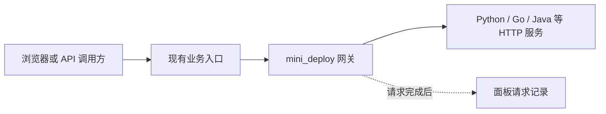

# 统一请求网关

让后端 HTTP 请求经过 mini_deploy 网关，即可查看路径、状态码和耗时。Python、Go、Java 等语言使用相同的接入方式，不需要安装语言 SDK，也不用逐个登记接口。现有 Caddy/Nginx 继续管理域名和 HTTPS。

请求采集与独立网关继续保留，不依赖 Git 部署项目、部署脚本或 WebHook。业务服务需预先运行；开启记录只配置流量入口，不构建或发布业务。



## 推荐：在网页启用

需要 Linux、本机 Docker，以及以 root 运行的 Agent。

1. 打开「请求记录 → 接入后端」，系统读取已发现的代理配置，汇总后端地址和转发规则。
2. 选择需要记录的后端入口。只有一个可接入入口时自动选择，并生成方案；多个网络无法确定时才询问网络。
3. 核对覆盖范围和重启提示，点击「开启记录」。通过原入口调用 API 后即可查看请求。

一条转发规则下的所有 HTTP 接口都会采集，例如 `/api/*` 下的登录、订单、查询接口，无需分别配置。同一域名的 API、Web 等不同转发规则可以分别接入和停止记录，互不覆盖。停止时点击「停止记录」，系统恢复原访问路径。

默认只列后端转发，静态站点在「未找到服务？调整检测来源 → 同时列出静态网站」中选择。容器、配置路径和网关参数默认收起。未能读取的来源显示具体错误，不代表没有后端服务。已有代理日志和网关维护位于「高级设置」。

系统会启动网关、备份入口配置、校验并应用，失败时尝试恢复。Caddy 使用重启，已有连接可能短暂中断；Nginx 使用重载。无需再复制一份接入脚本到服务器执行。

**页面会显示当前网站与采集范围。只有实际经过网关的请求才有记录。** 检测请求本身也会产生记录；请再用真实网址验证。只接入某个转发规则时，其余路径不采集。旧版手动创建的入口显示为“自定义入口”，不假定它已接入任何网站。

### 你的 Caddy 示例

系统会检测 Docker 容器 `aimore-caddy-1` 并尝试读取 `/etc/caddy/Caddyfile`。检测失败时，在「未找到服务？调整检测来源」中核对这两个值；配置路径填写容器内路径。

- API：选择 `http://aimore-cloud:8766` 对应 `aimore.meetpeak.tech` 的 `/cloud/*` 规则。唯一网络自动选中，检测路径默认 `/cloud/`；需要指定健康检查时，在高级选项填 `/cloud/health`。已有 `aimore-api` 网关配置一致时可以复用。
- 主站：另选 `meetpeak.tech` 静态站点，新建不同标识和监听端口的网关。向导保留原静态文件规则，增加内部 HTTP 入口，再接入网关。无需新增 Docker 宿主机端口映射。

只接入 API，不会记录主站访问。网络名以检测结果为准；Docker 服务名不能在“服务器本机”网络中解析。

## 不知道怎么填

网页有「不知道怎么填？查看查询指令」，可直接复制。先在服务器终端运行，再按提示填写：

| 查询内容 | 指令 | 填写方式 |
| --- | --- | --- |
| 代理容器 | `docker ps --format 'table {{.Names}}\t{{.Image}}\t{{.Ports}}'` | 将代理对应的 NAMES 填入容器名称 |
| 配置挂载 | `docker inspect 容器名称 --format '{{range .Mounts}}{{println .Source "->" .Destination}}{{end}}'` | 配置路径填写箭头右侧；挂载目录需补文件名 |
| Caddy 启动参数 | `docker inspect 容器名称 --format '{{json .Config.Cmd}}'` | 填写 `--config` 后面的路径 |
| Docker 网络 | `docker inspect 容器名称 --format '{{json .NetworkSettings.Networks}}'` | 代理和业务各查一次，选择共同网络 |
| 本机代理 | `systemctl is-active caddy nginx` | 对应项为 active 才表示本机服务正在运行 |
| 本机启动参数 | `systemctl show caddy nginx --property=ExecStart --value` | Caddy 的 `--config` 后面是配置路径 |
| 应用错误 | `docker logs --tail 80 容器名称` | 查看原始错误，不用填进表单 |

Nginx 不知道选哪个文件时，网页另有查询指令，按域名列出它所在的生效配置文件。查询失败会保留已填内容；对外提供日志前先遮盖密码和令牌。

## 自动接入的范围

- 本机或 Docker Caddy：常见单个 HTTP 后端，以及简单静态网站。支持 `{uri}`、`{query}` 等占位符，Docker 中 `{$PUBLIC_DOMAIN}` 这类域名变量会自动读取容器环境；无需用户改成固定域名。
- Caddy 的 `reverse_proxy` 块支持 `flush_interval` 和 HTTP transport 的常见超时选项。自动接入只替换所选上游地址，保留原规则及参数；网关连接超时跟随 Caddy（最高支持 75 秒），上传限制继续由外层 Caddy 控制，不会额外收紧为 64 MiB。超时格式或范围无法可靠支持时给出原因。
- 本机或 Docker Nginx：单个 HTTP 后端，规则需明确设置 Host、X-Forwarded-Proto 和 X-Forwarded-For。
- Docker 配置必须以 bind 方式挂载到宿主机；使用 host 或自定义 bridge 网络。
- 复杂配置会给出原因并拒绝自动改写，例如 Caddy import、多上游、动态上游、自定义转发头或 TLS transport、依赖客户端 IP 的静态规则、Nginx 静态站点。
- 本机 Caddy 的服务环境变量配置、Caddy --resume，以及 Nginx 自定义主配置/前缀暂不自动接入。

其他代理可在「高级设置 → 网关维护 → 手动新建」创建网关，由维护者把对应转发目标改为页面给出的网关地址：本机代理用 `127.0.0.1:监听端口`，同网络容器用 `mini-gateway-标识:10000`。采集仍统一在网关完成，不依赖代理日志格式。

## 撤销与维护

点击「停止记录」恢复原网站规则，网关仍保留运行。需要释放容器时，再到「高级设置 → 网关维护」中停止或删除。多个站点、同一站点的多个后端可独立撤销，保留其他规则的后续修改。旧版本以整站保存的接入记录，需先停止原接入，才能改为分开的后端规则。

配置备份在数据目录的 `gateway-connections/入口标识/`：`before.conf` 是接入前完整配置，`disconnect-before.conf` 是最近一次撤销前配置。备份不包含 Docker 容器或日志。

如规则被外部修改、Compose 重建了代理容器，或自动恢复失败，系统会停止自动覆盖并保留网关。先由维护者核对当前配置、容器挂载和备份再恢复，不能直接用旧文件覆盖整个站点配置。Agent 文件备份不会替你恢复外部代理的配置。

## 记录范围

- 不要求业务使用某种语言或框架，但必须提供受支持的 HTTP 服务。未经过所选入口的内部调用、定时任务、数据库请求不会自动记录；这不是语言级链路追踪。
- 面板自建网关的请求由 Agent 后台持续采集，网页关闭后仍保存。数据库在 `/var/lib/mini-deploy-agent/request-history/history.sqlite3`（自定义数据目录时随之改变），升级和面板重启保留历史。无需用户安装数据库或修改业务代码。
- 默认查询最近 24 小时，可选 1 小时、7 天。统计覆盖所选时段内仍保存的请求，按请求类型分页，每页 100 类；展开每类查看最近最多 30 条明细。高频心跳不会仅因为占满最近 100 条就挤掉其他已保存接口。
- 默认最多保留 7 天、全局 10 万条记录，同时使用约 96 MiB 的保守数据及索引预算，先触及的限制优先；超限清理较早历史，数据库文件上限 256 MiB，事务期间还会使用临时空间。页面显示当前最早记录；这不是无限期归档，也不承诺完整流量。
- 常规每轮完成后等待 5 秒继续采集。每个入口单批最多 5000 行、解析末尾最多 8 MiB，单轮最多处理 40 个入口并设时间预算；繁忙时可能延迟。达到单批上限会明确提示可能存在缺口，采集失败保留历史和游标并重试。
- 首次接入或容器更换时，尽量回填 Docker 当前保留的近 7 天日志，仍受单批限制。Agent 离线期间已经轮转删除的记录无法恢复。已落库的历史不会因容器删除而删除，可从服务列表中的历史记录入口查看。
- 公共前缀默认展开，直接显示不同请求类型，更深的分组可折叠。目录汇总本页所含请求的次数、平均耗时、平均上游耗时及成功率（2xx/3xx），按实际有效样本加权，不平均子项平均值。
- UUID、24/32 位十六进制段显示为 `:id`，纯数字段显示为 `:number`；方法和域名仍分别统计。这只是显示归类，不代表识别出了业务路由模板，数字年份等也可能归组，可切换「原始地址」核对。普通名称、带扩展名的文件和百分号编码段不推断为 ID。
- 展开末级请求可查看每次的原始路径；支持搜索原始用户/会话 ID。搜索和“含失败请求”筛选均保留命中分组内全部样本的统计。刷新保留仍存在分组的展开状态。
- 缺失耗时不计为 0。状态格展示该分组最近最多 30 次请求，成功率和平均耗时按所选时间范围内的已保存记录计算。
- 记录网关观察到的时间、方法、域名、路径、状态、总耗时和上游耗时，不代表浏览器完整加载时间。SSE/WebSocket 在连接结束后形成完整记录。
- 支持 HTTP 后端、SSE/WebSocket；不支持 HTTPS 上游、gRPC、TCP/UDP。外层 HTTPS 保留。
- 手动新建网关默认上传上限 64 MiB；网页自动接入 Caddy 时由外层 Caddy 继续控制上传限制。网关上游读写空闲超时为 1 小时，外层代理和业务仍可能有更小限制。
- 不记录查询参数、认证头、Cookie 和请求体。不要把密码或令牌放进 URL 路径。
- 网关原始 Docker 日志仍按每容器约 3 份、每份 10 MiB 轮转。数据库独立保留已采集记录，日志文件轮转不影响已经落库的内容。
- 「高级设置」中的已有 Nginx/Caddy 日志来源仍是近期日志预览（100/300 条），不纳入这套网关历史存储。它们不会自动改为采集网关。
- 向导默认只映射本机端口，并信任前置代理的转发头。只应允许可信代理和同网络容器连接，不要把网关端口直接暴露到公网。

## 开发验收

原生 Caddy/Nginx 联动测试：

```bash
MINI_DEPLOY_TEST_CADDY=/usr/bin/caddy \
MINI_DEPLOY_TEST_NGINX=/usr/sbin/nginx \
python3 -m pytest tests/test_gateway_connections_integration.py -q
```

专用 Linux Docker 测试机以 root 运行（会创建并清理临时容器和网络）：

```bash
MINI_DEPLOY_GATEWAY_DOCKER_TESTS=1 \
python3 -m pytest tests/test_request_gateway_integration.py tests/test_gateway_connections_integration.py -q
```

CI 已配置 Docker 验收。本地 Windows 原生代理通过不代表 Linux Docker 验收已通过。
