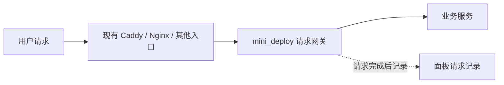

# 统一请求网关

让需要监控的业务请求经过 mini_deploy 管理的网关，就能在「请求记录」查看时间、方法、路径、状态码、总耗时和上游耗时。无需修改业务代码，也无需给不同代理分别配置访问日志。



网关内部使用成熟的 Nginx 转发核心，由面板生成并管理配置。每个入口对应一个独立 Docker 容器；Agent 重启不会停止网关。已有 Caddy 继续管理域名和 HTTPS，网关不占用 80、443 或面板的 6868。

## 1. 在页面创建入口

服务器需要 Linux、本机 Docker，Agent 以 root 运行。没有 Docker 时先用安装向导安装。无需在「部署」页登记业务仓库。

打开「请求记录 → 管理网关 → 新增入口」，填写：

| 配置 | 后端在服务器本机 | 后端在 Docker |
| --- | --- | --- |
| 入口标识 | `my-api` | `aimore-api` |
| 名称 | 业务 API | AimOre API |
| 后端 HTTP 地址 | `http://127.0.0.1:8000` | `http://aimore-cloud:8766` |
| 后端所在网络 | 服务器本机 | 选择业务服务所在的自定义 bridge 网络 |
| 宿主机监听端口 | `18080`，有占用就换一个 | 同左 |
| 宿主机访问范围 | 默认「仅本机」 | 默认「仅本机」 |

保存后点击「启动」。首次启动自动拉取网关镜像，沿用服务器已有 Docker 镜像源设置。拉取失败时可修改尚未创建容器的入口，填写官方 Nginx 的兼容镜像副本后重试。

「仅本机」限制的是宿主机映射端口；同一 Docker 网络内的容器仍能访问网关的 `10000` 端口。

只允许可信前置代理连接时，可以勾选「信任前置代理」以向业务服务保留原始 HTTP/HTTPS 协议和转发链。网关默认不信任客户端传入的这两个请求头；不要对公开直连入口随意开启此项。HTTPS 在外层终止、业务依赖原始协议时应开启。

## 2. 你当前的 AimOre / Caddy 怎么接

先确认 Caddy 和业务服务共享的网络：

```bash
docker inspect aimore-caddy-1 aimore-aimore-cloud-1 \
  --format '{{.Name}} {{range $name, $value := .NetworkSettings.Networks}}{{$name}} {{end}}'
```

在页面选择输出中两者共有的网络，不要照抄猜测的网络名称。创建 `aimore-api`，后端填写 `http://aimore-cloud:8766`，保存并启动。

在服务器先测试网关，不切换线上流量：

```bash
curl --max-time 10 -i -H 'Host: aimore.meetpeak.tech' \
  http://127.0.0.1:18080/cloud/health
```

确认返回业务正常响应，并能在面板的「统一网关 → AimOre API」看到记录。

备份并打开你当前的 Caddyfile：

```bash
cp -p /opt/aimore/deploy/aimore-cloud/Caddyfile \
  "/opt/aimore/deploy/aimore-cloud/Caddyfile.bak.$(date +%Y%m%d-%H%M%S)"
nano /opt/aimore/deploy/aimore-cloud/Caddyfile
```

仅把 `aimore.meetpeak.tech` 中的这一段上游改为页面给出的容器地址：

```caddyfile
handle /cloud/* {
    reverse_proxy mini-gateway-aimore-api:10000
}
```

保留其他配置。主站静态文件和不经过这个 `handle` 的请求不会被网关记录。无需增加 Caddy 的 `log` 配置。

你的 Caddy 设置了 `admin off`，不能调用管理 API 重载。先校验刚编辑的宿主机文件，再重启容器：

```bash
if docker exec -i aimore-caddy-1 caddy validate \
    --config /dev/stdin --adapter caddyfile \
    < /opt/aimore/deploy/aimore-cloud/Caddyfile; then
  docker restart aimore-caddy-1
else
  echo '配置校验失败，未重启。请修正后重试。'
fi
curl --max-time 10 -i https://aimore.meetpeak.tech/cloud/health
```

用标准输入校验，是为了避免编辑器替换文件后，容器内单文件挂载仍暂时指向旧文件。重启可能短暂中断连接。若异常，把上游恢复为 `aimore-cloud:8766`，再次校验并重启；先恢复业务流量，再处理网关。

## 3. 换成其他代理也一样

只需把需要监控的转发目标改为网关地址。宿主机代理使用 `127.0.0.1:18080`；同网络容器代理使用页面给出的 `mini-gateway-入口标识:10000`。容器里的 `127.0.0.1` 不是宿主机。

例如本机 Nginx 原来的 `location` 中，上游可改为：

```nginx
proxy_pass http://127.0.0.1:18080;
```

保留业务原有的路径匹配、请求头、SSE/WebSocket 等代理配置。外层代理同样需要支持对应协议；仅网关关闭缓冲，无法解除外层代理的缓冲。校验并重载原代理后生效。

没有前置代理时，也可以选「所有网卡」，让客户端通过服务器 IP 和所填端口访问。此方式是 HTTP，不自动签发证书；仅在确实需要直连时开放该端口，网关不会替业务增加登录认证。

## 4. 查看和维护

- 请求页面每 10 秒刷新，可按路径、域名和状态筛选，最多展示最近 300 条。采集始终发生在网关，不依赖网页保持打开。
- 耗时是网关观察到的时间，不是函数耗时或用户浏览器的完整加载时间。SSE/WebSocket 等长连接关闭后才形成完整记录。
- 支持 HTTP 后端、普通 HTTP 转发、SSE 和 WebSocket。当前不支持 HTTPS 上游、gRPC、TCP/UDP 代理；外层 HTTPS 可继续使用。
- 上传上限 64 MiB，上游读写空闲超时 1 小时；不是业务总执行时间上限。已有外层代理可以有更小的限制。
- 不记录查询参数、认证头、Cookie 和请求体。路径本身仍可能包含业务标识，避免把密码或 Token 放进路径。
- 日志使用 Docker 本地轮转，每个容器最多约 3 份、每份 10 MiB；页面读取最近 1000 行中的有效记录，不提供永久归档。删除容器会删除日志。
- 修改运行中入口的后端地址会先校验再平滑重载；原有长连接可能继续连接旧后端。更新失败恢复旧配置，中断的更新在下次保存或启动时恢复。
- 容器创建后，端口、网络和镜像不能原地修改。需要变更时新建入口，测试并切换流量，再停止、删除旧入口。
- 停止或删除前，必须先把前置代理切回原业务上游。运行中的入口禁止直接删除。

遇到 502，检查所选网络和后端服务名；「运行中」只代表网关启动，不代表业务接口健康。配置默认保存在 `/var/lib/mini-deploy-agent/request-gateways/`，随数据目录备份；Docker 容器、镜像和容器日志不在面板文件备份内。

## 开发验收

普通单元测试与浏览器测试不需要启动 Docker。真实转发测试可以指定本机 Nginx 二进制：

```bash
MINI_DEPLOY_TEST_NGINX=/usr/sbin/nginx \
  python -m pytest tests/test_request_gateway_integration.py -q
```

在专用 Linux Docker 测试机以 root 运行以下命令，会创建临时网络及测试容器，检查实际容器权限、流式响应、WebSocket、网络解析、重载和生命周期，并在结束后清理测试资源：

```bash
MINI_DEPLOY_GATEWAY_DOCKER_TESTS=1 \
  python3 -m pytest tests/test_request_gateway_integration.py -q
```

仓库 CI 已加入同一 Docker 验收任务。本地 Windows 上的原生 Nginx 通过不代表 Linux Docker 验收已经通过。
